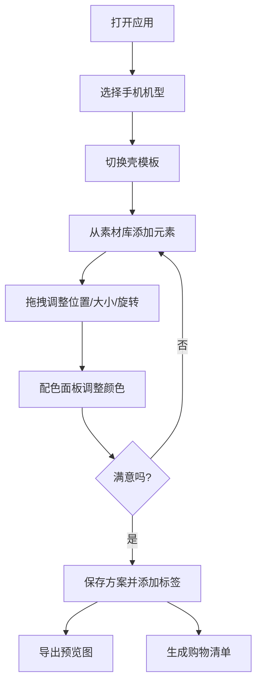

## 1. 产品概述

手机壳贴纸与挂件搭配预览器是一款面向年轻用户群体的创意搭配工具，解决用户在购买手机壳及配件前无法直观预览整体搭配效果的痛点。用户可以选择手机机型，在虚拟画布上切换不同壳模板，拖拽贴纸、挂件、镜头圈和文字标签进行自由组合，实现个性化手机壳的可视化预览。

- 目标用户：追求个性化的年轻消费者、手机配件爱好者
- 产品价值：降低购买决策成本，激发创意灵感，提升购物体验

## 2. 核心功能

### 2.1 功能模块

1. **主画布区**：手机机型选择、壳模板切换（透明壳/纯色壳/镜面壳）、可拖拽元素放置与编辑
2. **素材库面板**：贴纸素材、挂件素材、镜头圈素材、文字标签添加
3. **配色面板**：纯色壳颜色选择、文字颜色编辑、渐变配色方案
4. **历史方案区**：多套方案保存、标签分类（通勤/可爱/极简/节日）、方案加载与删除
5. **工具栏**：撤销/重做、清空画布、保存方案、导出预览图、生成购物清单

### 2.2 页面详情

| 页面名称 | 模块名称 | 功能描述 |
|---------|---------|---------|
| 主页面 | 顶部导航栏 | Logo展示、操作快捷按钮（保存、导出、购物清单） |
| 主页面 | 左侧素材库 | 素材分类标签页（贴纸/挂件/镜头圈/文字）、素材网格展示、点击/拖拽添加到画布 |
| 主页面 | 中央画布区 | 手机机型下拉选择、壳模板切换、可拖拽元素渲染与交互 |
| 主页面 | 右侧控制面板 | 配色面板（壳颜色/文字颜色）、元素属性编辑（位置/大小/旋转）、当前方案信息 |
| 主页面 | 底部历史方案区 | 方案卡片网格、标签筛选、方案加载/删除/重命名 |

## 3. 核心流程

用户打开应用 → 选择手机机型 → 切换壳模板（透明/纯色/镜面）→ 从素材库选择或拖拽贴纸/挂件/镜头圈到画布 → 添加文字标签并编辑 → 在配色面板调整壳色和文字色 → 调整元素位置、大小和旋转角度 → 保存方案并添加分类标签 → 导出预览图或生成购物清单

## 4. 用户界面设计

### 4.1 设计风格

- **主色调**：采用温柔的奶油粉 #FFE4E6 作为主色，搭配静谧紫 #C4B5FD 和薄荷绿 #A7F3D0 作为辅助色，整体呈现年轻、活力、甜酷的设计氛围
- **按钮风格**：圆角胶囊形按钮，带轻微阴影和 hover 上浮效果
- **字体**：使用 Poppins 作为主字体，搭配思源黑体做中文补充，标题用 SemiBold，正文用 Regular
- **布局风格**：三栏式布局（左侧素材库 + 中央画布 + 右侧控制面板）+ 底部历史方案抽屉，卡片式设计，各区域有明显的视觉分隔
- **图标风格**：使用 Lucide 线性图标，保持纤细统一的线条风格

### 4.2 页面设计概述

| 页面名称 | 模块名称 | UI元素 |
|---------|---------|--------|
| 主页面 | 顶部导航栏 | 渐变背景Logo、胶囊形操作按钮组、当前方案名称编辑 |
| 主页面 | 左侧素材库 | 分类标签切换栏、素材卡片网格（带hover放大效果）、素材搜索框 |
| 主页面 | 中央画布区 | 手机机型选择器、壳模板切换Tab Bar、带阴影的立体手机画布、拖拽控制点 |
| 主页面 | 右侧控制面板 | 配色渐变卡、颜色拾取器、滑块控件（大小/旋转/透明度）、元素列表 |
| 主页面 | 底部历史方案区 | 标签筛选栏、方案缩略图卡片、方案操作菜单 |

### 4.3 响应式设计

- 桌面端（≥1440px）：标准三栏布局，各区域完整展示
- 平板端（768-1439px）：左侧素材库收起为侧边栏图标，点击展开；底部历史方案区默认收起
- 移动端（<768px）：单栏布局，画布居上，各面板以Tab形式切换，支持触摸拖拽

### 4.4 动效设计

- 页面加载：元素依次淡入，延迟错开形成流畅的入场动画
- 拖拽交互：拖拽时元素带轻微缩放和旋转跟随，放置时有弹性回弹效果
- 按钮交互：hover 时上浮 + 阴影加深，click 时轻微按压
- 方案切换：画布内容带轻微缩放过渡
