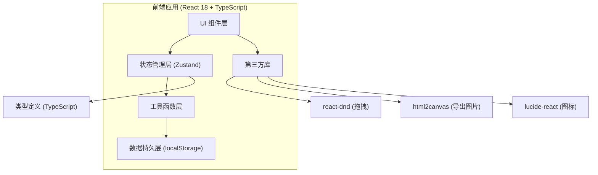
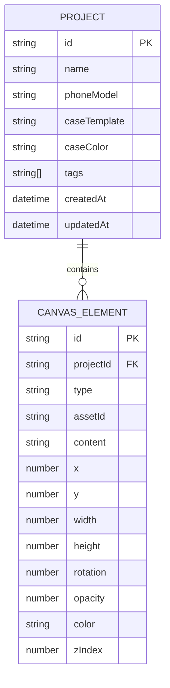

## 1. 架构设计



## 2. 技术描述

- **前端框架**：React@18 + TypeScript@5 + Vite@5
- **样式方案**：TailwindCSS@3 + CSS Variables
- **状态管理**：Zustand（轻量级状态管理，支持持久化中间件）
- **拖拽实现**：自定义拖拽 Hook（基于 Pointer Events，支持桌面和移动端）
- **图片导出**：html2canvas（将 Canvas DOM 转换为图片）
- **图标库**：lucide-react
- **数据持久化**：localStorage（存储方案数据）
- **初始化工具**：vite-init（react-ts 模板）

## 3. 路由定义

| 路由 | 用途 |
|-----|------|
| / | 主页面（单页应用，所有功能在同一页面） |

## 4. 数据模型

### 4.1 数据模型定义



### 4.2 TypeScript 类型定义

```typescript
// 手机机型
interface PhoneModel {
  id: string;
  name: string;
  width: number;      // 画布宽度(px)
  height: number;     // 画布高度(px)
  cornerRadius: number;
  cameraArea: { x: number; y: number; width: number; height: number };
}

// 壳模板类型
type CaseTemplate = 'transparent' | 'solid' | 'mirror';

// 画布元素类型
type ElementType = 'sticker' | 'charm' | 'lens-ring' | 'text';

// 画布元素
interface CanvasElement {
  id: string;
  type: ElementType;
  assetId?: string;           // 素材ID（贴纸/挂件/镜头圈）
  content?: string;           // 文字内容
  x: number;                  // 相对画布X坐标 (%)
  y: number;                  // 相对画布Y坐标 (%)
  width: number;              // 宽度 (px)
  height: number;             // 高度 (px)
  rotation: number;           // 旋转角度 (deg)
  opacity: number;            // 透明度 (0-1)
  color?: string;             // 文字/元素颜色
  zIndex: number;
  scale?: number;             // 缩放比例
}

// 素材
interface Asset {
  id: string;
  type: ElementType;
  name: string;
  thumbnail: string;          // 缩略图 URL
  svg?: string;               // SVG 内容 (用于贴纸/挂件)
  defaultWidth: number;
  defaultHeight: number;
  category: string;
}

// 方案标签
type ProjectTag = '通勤' | '可爱' | '极简' | '节日' | '炫酷' | '文艺';

// 保存的方案
interface Project {
  id: string;
  name: string;
  phoneModel: string;
  caseTemplate: CaseTemplate;
  caseColor: string;
  elements: CanvasElement[];
  tags: ProjectTag[];
  thumbnail?: string;         // 缩略图 dataURL
  createdAt: number;
  updatedAt: number;
}

// 购物清单项
interface ShoppingItem {
  id: string;
  name: string;
  type: string;
  quantity: number;
  estimatedPrice: number;
}
```

## 5. 项目结构

```
src/
├── components/
│   ├── Canvas/              # 画布相关组件
│   │   ├── PhoneCanvas.tsx       # 手机画布主组件
│   │   ├── CaseRenderer.tsx      # 壳模板渲染
│   │   ├── DraggableElement.tsx  # 可拖拽元素
│   │   └── PhoneSelector.tsx     # 机型选择器
│   ├── AssetLibrary/        # 素材库组件
│   │   ├── AssetLibrary.tsx      # 素材库主面板
│   │   ├── AssetCategoryTabs.tsx # 分类标签
│   │   ├── AssetCard.tsx         # 素材卡片
│   │   └── TextEditor.tsx        # 文字编辑器
│   ├── ColorPanel/          # 配色面板
│   │   └── ColorPanel.tsx
│   ├── HistoryPanel/        # 历史方案区
│   │   ├── HistoryPanel.tsx
│   │   ├── ProjectCard.tsx
│   │   └── TagFilter.tsx
│   ├── PropertyPanel/       # 元素属性编辑面板
│   │   └── PropertyPanel.tsx
│   ├── Toolbar/             # 顶部工具栏
│   │   └── Toolbar.tsx
│   └── Modals/              # 弹窗组件
│       ├── ExportModal.tsx
│       └── ShoppingListModal.tsx
├── hooks/                   # 自定义 Hooks
│   ├── useDrag.ts               # 拖拽逻辑
│   ├── useResize.ts             # 缩放逻辑
│   └── useLocalStorage.ts       # localStorage 封装
├── store/                   # Zustand 状态管理
│   └── useDesignStore.ts
├── data/                    # 静态数据
│   ├── phoneModels.ts           # 手机机型数据
│   └── assets.ts                # 素材数据
├── utils/                   # 工具函数
│   ├── exportImage.ts           # 导出图片
│   ├── shoppingList.ts          # 生成购物清单
│   └── idGenerator.ts           # ID 生成器
├── types/                   # TypeScript 类型定义
│   └── index.ts
├── App.tsx
├── main.tsx
└── index.css
```
